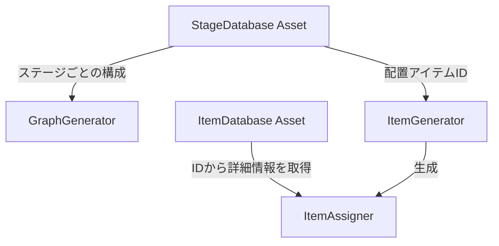

# Database コンポーネント ドキュメント

Databaseコンポーネントは、ゲームの静的なデータ（ステージ情報やアイテムのマスターデータなど）を管理するための機能群です。Unityの `ScriptableObject` を利用しており、エディタ上でデータを容易に編集・保存できます。

## ディレクトリ構成

```
Assets/Components/Game/Database/
├── StageDatabase.cs       # ステージデータ（グラフ構造、アイテム配置）の定義
├── StageDatabase.asset    # 作成されたステージデータの実体
├── ItemDatabase.cs        # アイテムマスターデータ（IDとパラメータの対応）の定義
├── ItemDatabase.asset     # 作成されたアイテムデータベースの実体
└── Database.md            # 本ドキュメント
```

## 主なクラス

### 1. StageDatabase (`Assets/Components/Game/Database/StageDatabase.cs`)

各ステージの構成情報を管理するデータベースです。

*   **役割**: `GraphGenerator` や `ItemGenerator` にデータを提供します。
*   **管理データ (`StageData`)**:
    *   `Stage Name`: ステージ名。
    *   `Graph Data`:
        *   `Vertices`: グラフの頂点リスト（座標、タスク時間）。
        *   `Edges`: グラフの辺リスト（接続関係）。
    *   `Item Data`:
        *   `Item Ids`: そのステージに配置されるアイテムのIDリスト。

#### 使い方
1.  Projectウィンドウで右クリック > `Create > Game > StageDatabase`。
2.  作成されたアセットのインスペクターで、`Stages` リストにステージ情報を追加します。
3.  `GraphGenerator` や `ItemGenerator` のインスペクターにこのアセットをセットして使用します。

### 2. ItemDatabase (`Assets/Components/Game/Database/ItemDatabase.cs`)

ゲーム内に登場するアイテムのマスターデータを管理するデータベースです。

*   **役割**: アイテムID（文字列）をキーとして、アイテムの詳細情報（名前、スプライト、効果など）を検索・取得するために使用されます。
*   **管理データ (`ItemData`)**:
    *   `ID`: アイテムを一意に識別する文字列（例: "potion_heal"）。
    *   `Name`: 表示名。
    *   `Icon`: アイテムのアイコン画像 (`Sprite`)。
    *   `Description`: 説明文など（実装に応じて拡張）。

#### 使い方
1.  Projectウィンドウで右クリック > `Create > Game > ItemDatabase`。
2.  作成されたアセットのインスペクターで、`Items` リストにアイテム情報を登録します。
3.  ゲーム内のスクリプト（例: `ItemAssigner`）から、IDを使ってアイテム情報を取得します。

## データフロー



